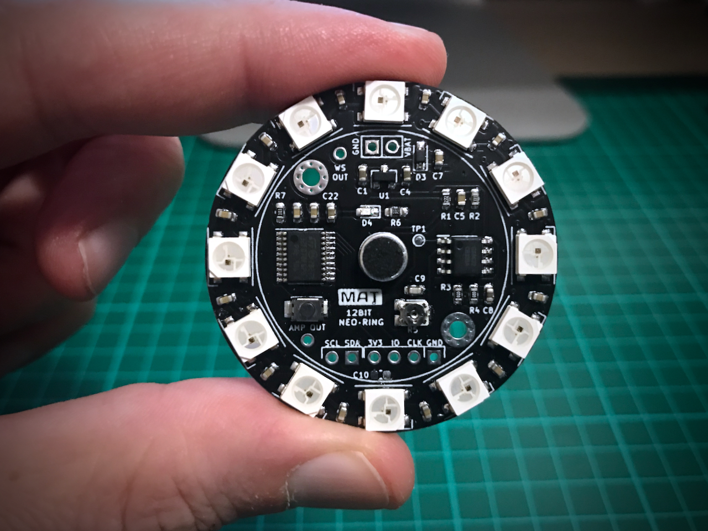

 

# 12Bit Neo-Ring

12Bit Neo-Ring is a programmable sound reactive board with 12 full-color Neopixel leds, specially designed to be used as a wearable device or a gadget for other audio systems.

Here you can find the board schematic and sample code installed by default on the board. You can see the results in [this video][video link].

## IDE Environment
The sorce code is generated from STM32CubeIDE. 

For a different IDE, you can open the .ioc file with STM32CubeMX, change the Toolchain / IDE selection from the Project Manager tab and generate the new project structure. In this scenario is better to copy the .ioc file to a new folder before generating the project.

## How sample works

[Here][ws2812 blog] is a good explanation of how WS281x works. If you have no experience with this leds, I strongly recommend you to read the blog before trying to modify the source code.

This sample code uses three different peripherals from the micro: ADC, TIMERS and DMA. 
The sound is sampled by the analog-to-digital converter (ADC) with a resolution of 12bits. The conversion is triggered by a TIMER configured at 4KHz, so we can show the sound spectrum up to 2KHz (Nyquist theorem) on the last mode of operation.

Led communication is done with a Timer configured to work at 800KHz. DMA is used to send data to the timer channel as a PWM signal, so the CPU is unloaded as much as possible during all the process.

#### Spectrum Analyzer
Due to the MCU limitation in terms of memory and power (no FPU), we cannot use DFT or FFT transformations, even less DSP libraries. Fortunately I [found a routine][fft] that implements FFT transformations with fixed-point short integers. Also I've used an integer square root implementation [from here][sqrt]. 

## Button functionality

### Effect selection
Push button to switch between available effects:

#### Sound pressure Gauge

#### Double Half Ring

#### Half ring centered and mirrored

#### Half ring mirrored with rotation

#### Spectrum Analyzer - FFT

### Change brightness
By default brightness is configured with maximum value. To change this value press and hold button for 3 seconds. Now you can press again to set the desired value.

Wait for another three seconds without pressing the button to exit the setup with the new value applied.

 

[video link]:  https://www.youtube.com/watch?v=WT_J5xFmNsg
[ws2812 blog]: http://fabioangeletti.altervista.org/blog/stm32-interface-ws2812b/?doing_wp_cron=1528043483.7364630699157714843750
[cubeMX link]: https://www.st.com/en/development-tools/stm32cubemx.html
[vscode link]: https://marketplace.visualstudio.com/items?itemName=bmd.stm32-for-vscode
[cubeide repo]: https://github.com/manoloaterol/12Bit-Neo-Ring_STM32CubeIDE
[fft]: https://www.jjj.de/fft/fftpage.html
[sqrt]: https://stackoverflow.com/questions/1100090/looking-for-an-efficient-integer-square-root-algorithm-for-arm-thumb2

