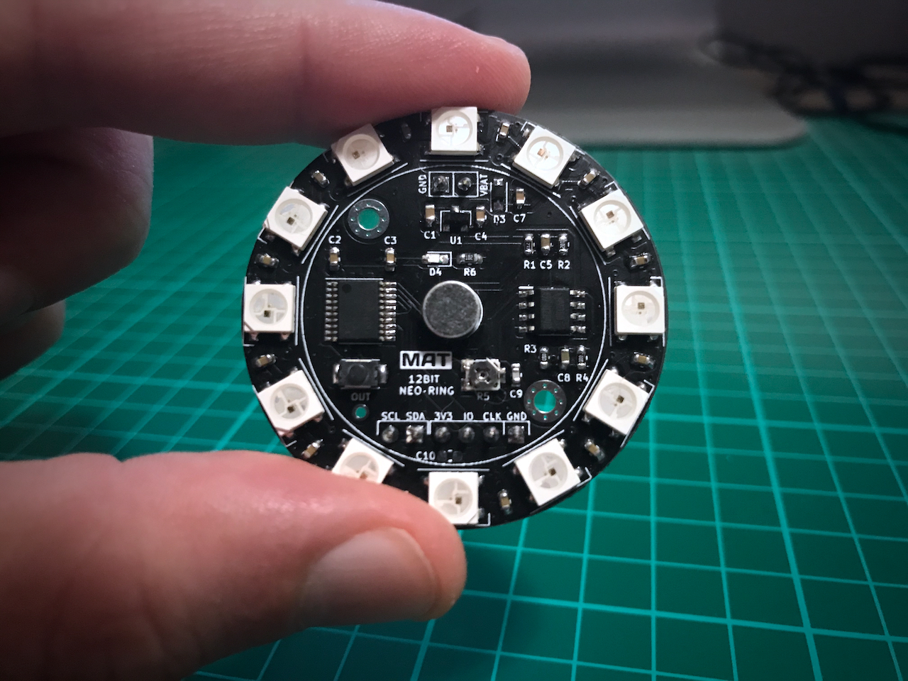

# 12Bit Neo-Ring

 

12Bit Neo-Ring is a programmable sound reactive board with 12 full-color Neopixel leds, specially designed to be used as a wearable device or a gadget for other audio systems.

Here you can find the board schematic and sample code installed by default on the board. You can see the results in [this video][video link].

## IDE Environment
The sorce code is generated from [STM32CubeMX][cubeMX link] as a Makefile project, so it can be compiled from command line or using VSCode with the [STM32 VSCode][vscode link] extension. 

For a different IDE, you can open the .ioc file with STM32CubeMX, change the Toolckain / IDE selection from the Project Manager tab and generate the new project structure. In this scenario is better to copy the .ioc file to a new folder before generating the project.

## How sample works

[Here][ws2812 blog] is a good explanation of how WS281x works. If you have no experience with this leds, I strongly recommend you to read the blog before trying to modify the source code.

This sample code uses three different peripherals from the micro: ADC, TIMER and DMA. 
The sound is sampled by the analog-to-digital converter (ADC) with a resolution of 12bits in continuous mode. DMA is used in circular mode to save values from ADC to the memory, so no CPU computation is used for this task.
Led communication is done with a Timer configured to work at 800KHz. Again, DMA is used to send data to the timer channel as a PWM signal, so the CPU is unloaded as much as possible during all the process.

[video link]:  https://www.youtube.com/watch?v=WT_J5xFmNsg
[ws2812 blog]: http://fabioangeletti.altervista.org/blog/stm32-interface-ws2812b/?doing_wp_cron=1528043483.7364630699157714843750
[cubeMX link]: https://www.st.com/en/development-tools/stm32cubemx.html
[vscode link]: https://marketplace.visualstudio.com/items?itemName=bmd.stm32-for-vscode

